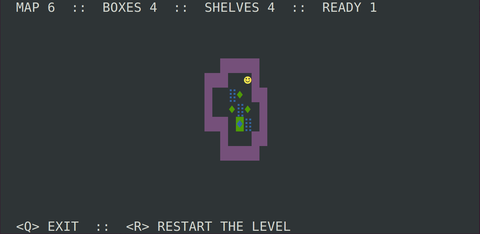

# The "SOKOBAN" game

Well-known old game "Sokoban", works just from console.



Run:

```
$> python3 sokoban.py
```
or 
```
$> python3 sokoban.py 3   # specify number of level
```

Wrote it just for fun for my kids in spare ~4 hours. So, don't judge strickly, it's just a toy code to show my kids what is all the programming about. :)

(Well yeah, spend 4 hours and you'll get just *THIS* :-D)

Feel free to add new levels in `mazes` dir. ;)
